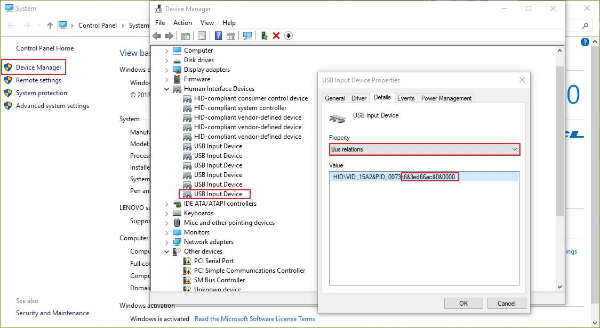
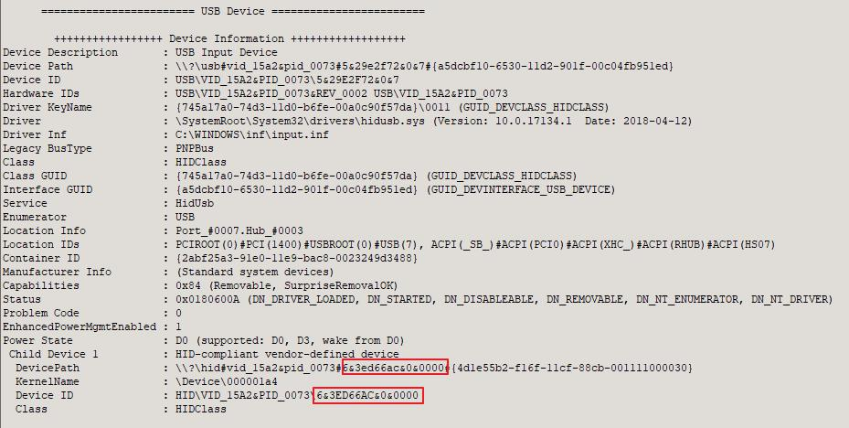

English | [简体中文](insert_multiple_devices_with_the_same_vid_pid.zh-CN.md)

When `mboot` is used without specifying the corresponding device parameters, `mboot` enters the automatic search mode. At this time, if more than one device is found in the [device search scope](../README.md#Appendix:%20automatic%20device%20search%20range), then `mboot` prints their information and sends prompts, even if they have the same `vid` and `pid`. If you don't need a pop-up prompt, you need additional information to distinguish them:

### usb

For `usb` devices, we specify the information we need to enter manually through `--select_device`. Note that `usb` devices require different information under `linux` and `windows`:

#### windows

`Windows` insert multiple devices with the same `pid`, `vid` are prompted as follows:


We can distinguish the two through the red box section, which is actually `Bus relations` that we can find in `Device Manager`:



It is recommended to use the [USB Device Tree Viewer](https://www.uwe-sieber.de/usbtreeview_e.html) under `Windows`.



You can also specify it manually with '--select_device', which you may need to use in quotes because of the `&` sign:

```sh
$ mboot -u --select_device "6&3ed66ac&0&0000" info
```

Due to the nature of `argprase` library, because there is no order conflict with `--select_device`, so it could also be simplified as this:

```sh
$ mboot -u --select "6&3ed66ac&0&0000" info
$ mboot -u --se "6&3ed66ac&0&0000" info
```

When only `--select_device` is specified without `vid`, `pid`, all `usb` devices are searched and their values are compared.


#### linux

The same is true for `linux`, except that the information is `device path`. You can use the command `lsusb` to view it, and then select the corresponding device according to the prompts. If you want to manually specify, for example, 'Bus 003 device 004', you can write it as `3,4`, as follows:

```sh
$ sudo mboot -u --select_device 3,4 info
```

### SPI, I2C

For `SPI`, `I2C` devices, `--ftdi_index` can be used to specify the serial number of devices. What does this number mean? `Windows` can be viewed through the `USB Device Tree Viewer`, which is in ascending order from top to bottom, with the device number starting from zero. Similarly, we can view through the `lsusb` command under `linux`:

```sh
$ lsusb
Bus 002 Device 002: ID 8087:8000 Intel Corp. 
Bus 002 Device 001: ID 1d6b:0002 Linux Foundation 2.0 root hub
Bus 001 Device 002: ID 8087:8008 Intel Corp. 
Bus 001 Device 001: ID 1d6b:0002 Linux Foundation 2.0 root hub
Bus 004 Device 001: ID 1d6b:0003 Linux Foundation 3.0 root hub
Bus 003 Device 007: ID 17ef:6019 Lenovo 
Bus 003 Device 012: ID 0403:6014 Future Technology Devices International, Ltd FT232H Single HS USB-UART/FIFO IC
Bus 003 Device 014: ID 0403:6014 Future Technology Devices International, Ltd FT232H Single HS USB-UART/FIFO IC
Bus 003 Device 009: ID 0d28:0204 NXP LPC1768
Bus 003 Device 010: ID 0d28:0204 NXP LPC1768
Bus 003 Device 011: ID 15a2:0073 Freescale Semiconductor, Inc. 
Bus 003 Device 002: ID 1241:1503 Belkin Keyboard
Bus 003 Device 001: ID 1d6b:0002 Linux Foundation 2.0 root hub
```

We can see that there are two `FT232H` devices with the same `vid`, `pid`, but one is the 12th device on `BUS 3` and the other is the `14th` device. Therefore, the number of the former device is `1` and the number of the latter is `2`. To select the first device for `SPI` communication, we can enter:

```sh
$ sudo mboot -s --ftdi_index 1 info   # 打印设备信息
```

Whenever interactive mode is your good helper, if you are unsure device order number, you can omit all the information and just type `sudo mboot-s info` to see the prompt. Note that if you manually specify `vid`, `pid`, so equipment order number may be smaller than that in the message number, when you insert a number of different `vid`, `pid` devices (such as insert both `vid`, `pid` the same equipment and another `vid`, `pid` different devices), because the range is smaller, when check the message so you will need to be synchronized to specify `vid`, `pid`.
