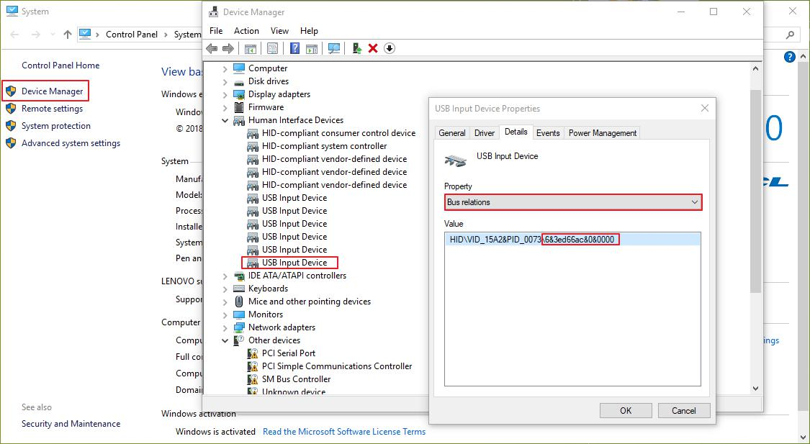
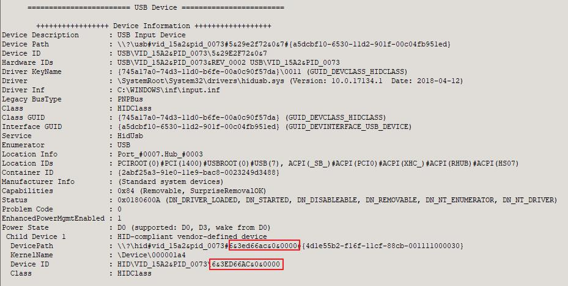

[English](insert_multiple_devices_with_the_same_vid_pid.md) | 简体中文

使用`mboot`时不指定相应的设备参数时，`mboot`会进入自动搜索模式，此时，如果有多个在[设备搜索范围](../README.zh-CN.md#附录%20设备自动搜索范围)内的设备被发现, 那么`mboot`就会打印它们的信息并发出提示，即使是它们具有相同的`vid`, `pid`。如果你不需要弹出提示，那么就需要额外的信息来区分两者：

### usb

对于`usb`设备我们通过`--select_device`手动指定时需要输入的信息。注意`usb`设备在`linux`下和`windows`下所需要的信息是不同的：

#### windows

`windows`下插入多个具有相同`pid`, `vid`设备是提示如下：


我们可以通过红框部分区分两者，这实际上是`Bus relations`，我们可以在`Device Manager`中找到:



在`windows`下推荐使用[USB Device Tree Viewer](https://www.uwe-sieber.de/usbtreeview_e.html)查看：



你也可以手动通过`--select_device`来指定，由于其中带有`&`号，你可能需要使用引号：

```sh
$ mboot -u --select_device "6&3ed66ac&0&0000" info
```

由于`argprase`库的特性，因为目前没有什么命令和`--select_device`冲突，所以它也可以简写成下面这样：

```sh
$ mboot -u --select "6&3ed66ac&0&0000" info
$ mboot -u --se "6&3ed66ac&0&0000" info
```

当仅指定`--select_device`而不指定`vid`, `pid`时，会搜索所有`usb`设备，并比对它们的值。

#### linux

`linux`下同理，只不过信息是`device path`，可以使用命令`lsusb`来查看它，然后根据提示选择相应设备即可，如果你想要手动指定，比如选择`Bus 003 Device 004`的设备，那么可以写成数值对的样子`3,4`，比如下面这样：

```sh
$ sudo mboot -u --select_device 3,4 info
```

### SPI, I2C

对于`SPI`, `I2C`设备来说，可以通过`--ftdi_index`来指定设备顺序的编号，而这个编号怎么看呢？`windows`下可以通过`USB Device Tree Viewer`来查看，顺序从上到下依次递增，设备编号从零开始，`linux`下同理，通过`lsusb`命令来查看：

```sh
$ lsusb
Bus 002 Device 002: ID 8087:8000 Intel Corp. 
Bus 002 Device 001: ID 1d6b:0002 Linux Foundation 2.0 root hub
Bus 001 Device 002: ID 8087:8008 Intel Corp. 
Bus 001 Device 001: ID 1d6b:0002 Linux Foundation 2.0 root hub
Bus 004 Device 001: ID 1d6b:0003 Linux Foundation 3.0 root hub
Bus 003 Device 007: ID 17ef:6019 Lenovo 
Bus 003 Device 012: ID 0403:6014 Future Technology Devices International, Ltd FT232H Single HS USB-UART/FIFO IC
Bus 003 Device 014: ID 0403:6014 Future Technology Devices International, Ltd FT232H Single HS USB-UART/FIFO IC
Bus 003 Device 009: ID 0d28:0204 NXP LPC1768
Bus 003 Device 010: ID 0d28:0204 NXP LPC1768
Bus 003 Device 011: ID 15a2:0073 Freescale Semiconductor, Inc. 
Bus 003 Device 002: ID 1241:1503 Belkin Keyboard
Bus 003 Device 001: ID 1d6b:0002 Linux Foundation 2.0 root hub
```

我们可以看到，此时有两个`FT232H`设备，它们具有相同的`vid`, `pid`，但一个是`BUS 3`上的第`12`个设备，一个是第`14`个设备，所以前一个的编号为`1`，后一个编号为`2`，要选择第一个设备进行`SPI`通信就可以这么写：

```sh
$ sudo mboot -s --ftdi_index 1 info   # 打印设备信息
```

无论何时，交互模式都是你的好帮手，如果你不确定设备顺序的编号，你可以省略所有信息，只输入`sudo mboot -s info`来查看提示信息。注意，如果你同时手动指定`vid`, `pid`，那么设备顺序编号可能会小于提示信息中的编号，当你插入多个不同`vid`, `pid`的设备时（比如同时插入两个`vid`, `pid`相同的设备和另一个`vid`, `pid`不同的设备），因为范围变小了，所以在查看提示信息时，你就需要同步指定`vid`, `pid`。

